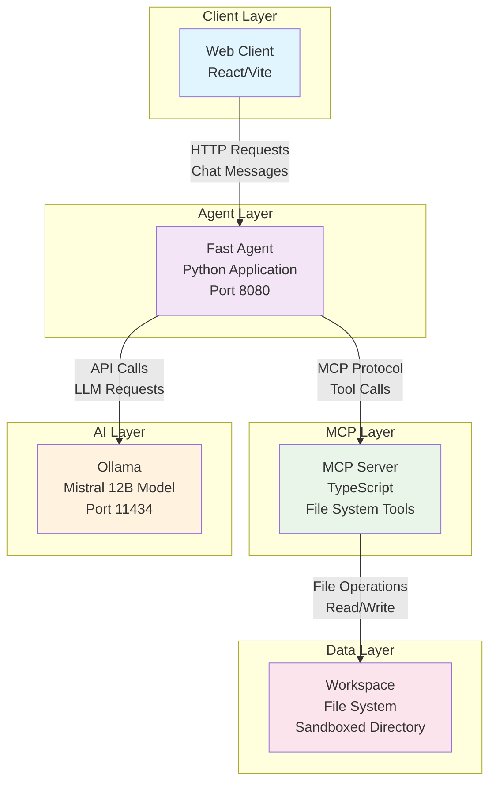

# Velora

Velora is a modular, local-first agentic brain — an Ollama-powered framework where models, tools, and memory connect through MCP (Model Context Protocol).

It’s designed to search, reason, and evolve over time, with a plug-and-play architecture that grows based on needs.

## Architecture



### Component Details

- **Web Client**: React/Vite-based interface for user interaction with hot reload
- **Fast Agent**: Python application that orchestrates MCP tools and LLM communication
- **MCP Server**: TypeScript server providing file system tools with security sandboxing
- **Ollama**: Local LLM server running Mistral 12B model
- **Workspace**: Sandboxed directory for secure file operations

## Prerequisites

- Python 3.8+
- Node.js 16+
- [uv](https://docs.astral.sh/uv/) for Python dependency management
- [Ollama](https://ollama.ai/) installed and running

## Quick Start

1. **Clone and setup:**

   ```bash
   git clone <repository-url>
   cd velora
   make setup
   make ollama-pull
   ```

2. **Start the agent (in another terminal):**

   ```bash
   make agent-serve
   ```

3. **Start the client:**

   ```bash
   make client-serve
   ```

That's it! The client will be running on `http://localhost:5173` and the agent on `http://localhost:8080`.

## Available Commands

Run `make help` to see all available commands:

- `make setup` - Initial setup (installs all dependencies)
- `make ollama-pull` - Download the required Ollama model
- `make mcp-build` - Build the MCP server
- `make agent-serve` - Start the agent server (builds MCP server first)
- `make client-serve` - Start the web client in development mode
- `make help` - Show all available commands

## Development

The project uses:

- **uv** for Python dependency management
- **npm** for Node.js dependencies
- **Make** for common tasks

See `Makefile` for available commands.
